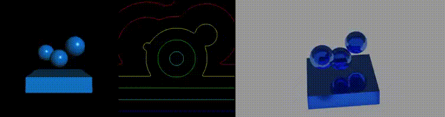

# Eulerian liquid simulator

[](https://github.com/daichi-nama/eulerian-liquid/actions/workflows/ubuntu.yml)

**This repository may be closed without notice.**

## Example



## Dependencies

- OpenMP
- Eigen
- GLFW3
- GLM
- ffmpeg
- Blender
- GoogleTest (optional)

## Building

```bash
mkdir build
cd build
cmake .. -DCMAKE_BUILD_TYPE=Release
make -j4
```

## Running Demos

In the build directory,

```bash
python3 ../script/run.py sample_3d
```

Check folder out/archives/{date}/sample_3d/sample0

## Reference

Bridson, Robert. *Fluid simulation for computer graphics*. AK Peters/CRC Press, 2015.
